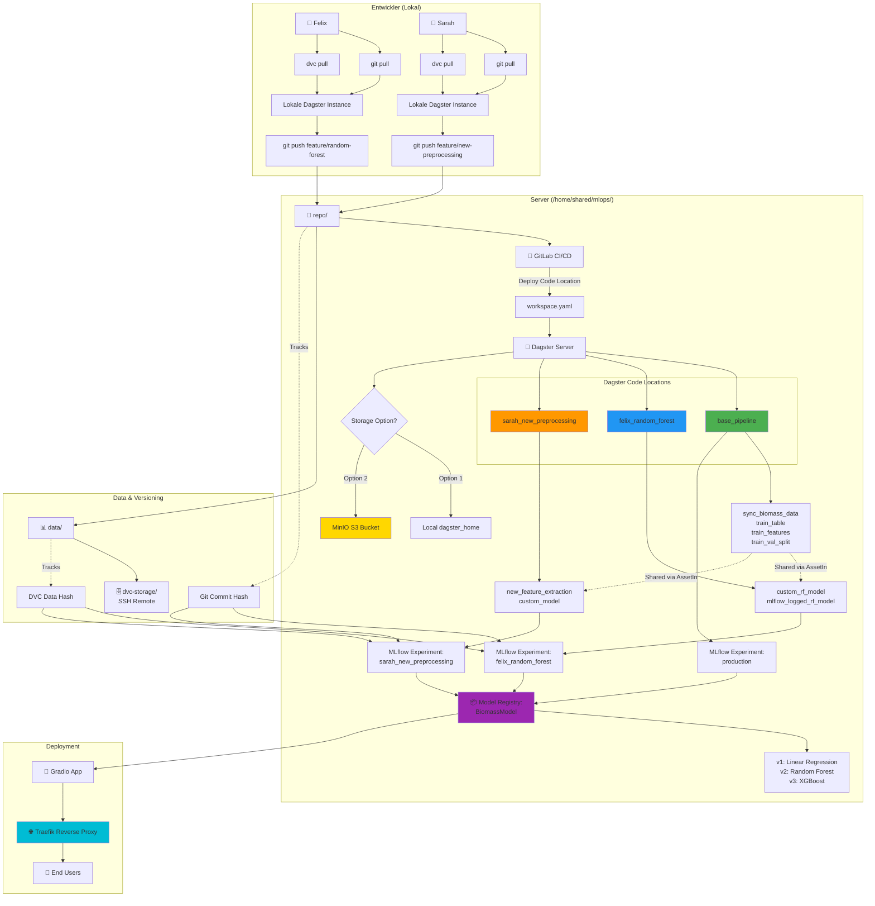
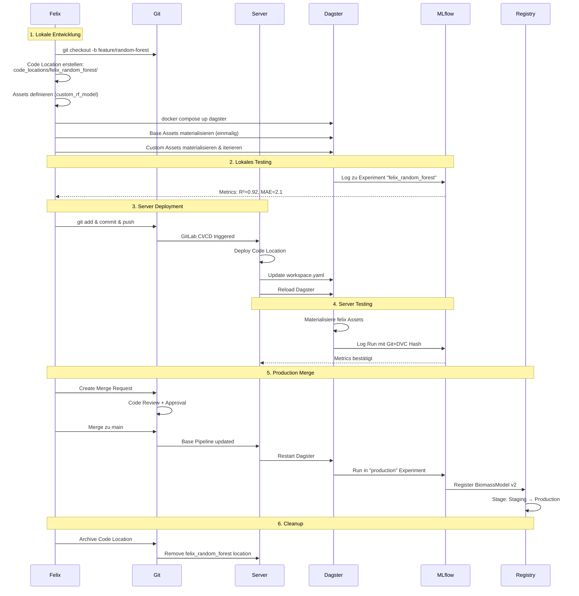
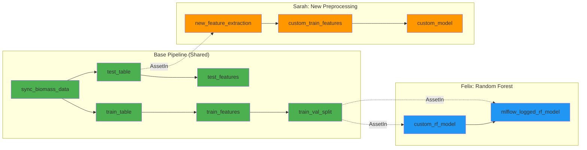
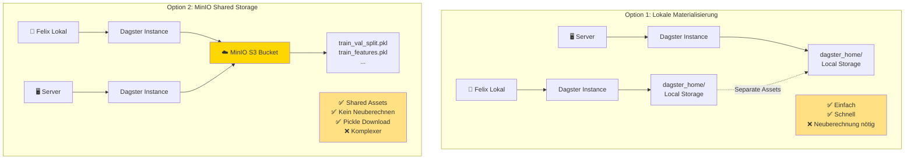

# Multi-Developer Workflow mit Dagster Code Locations

> **⚠️ DEPRECATED:** This workflow document is outdated. The project uses a simpler workflow with only code locations instead.

---

## Ziel

Mehrere Entwickler arbeiten parallel an ML-Experimenten (z.B. verschiedene Modelle), nutzen aber gemeinsam:
- Data Preprocessing (Base Pipeline)
- MLflow Model Registry
- DVC Data Versioning

## Architektur-Übersicht

### Server-Struktur

```
/home/shared/mlops/
├── repo/                          # Git Repository
│   ├── mlops-system-dagster/
│   │   ├── src/
│   │   │   ├── mlops_system_dagster/
│   │   │   │   ├── definitions.py        # Base Pipeline (shared)
│   │   │   │   ├── core_utils/           # Wiederverwendbare Module
│   │   │   │   │   ├── preprocessing.py
│   │   │   │   │   ├── training.py
│   │   │   │   │   └── evaluation.py
│   │   │   └── code_locations/           # Branch-spezifische Experimente
│   │   │       ├── felix_random_forest/
│   │   │       └── sarah_new_preprocessing/
│   │   └── workspace.yaml                # Dagster Code Locations Config
│   └── docker-compose_server.yml
├── data/                          # DVC-tracked data
├── dvc-storage/                   # DVC Remote (SSH auf Server)
└── system-state/
    ├── dagster_home/              # Dagster Metadata
    ├── mlflow_artifacts/          # MLflow Models
    ├── postgres/                  # MLflow Metadata DB
    ├── minio_data/                # MinIO (Optional: Shared Asset Storage)
    └── dvc_cache/
```

### Dagster Code Locations

**Base Pipeline** (`base_pipeline` Location):
- Assets: `sync_biomass_data`, `train_table`, `train_features`, `train_val_split`
- Wiederverwendbare Utils in `core_utils/`
- Von allen Entwicklern genutzt

**Developer Code Locations** (z.B. `felix_random_forest`):
- Nutzen Base Assets via `AssetIn("asset_name")`
- Definieren nur Custom Assets (z.B. neues Modell)
- Loggen zu separatem MLflow Experiment
- Ein Branch = Eine Code Location

**Workspace Config** (`workspace.yaml`):
```yaml
load_from:
  - python_module:
      module_name: mlops_system_dagster.definitions
      location_name: base_pipeline
  
  - python_file:
      relative_path: code_locations/felix_random_forest/definitions.py
      location_name: felix_random_forest
```

---

## Asset Storage: Zwei Optionen

### Option 1: Lokale Materialisierung (Einfach)

**Konzept**: Jeder Entwickler berechnet Base Assets lokal einmalig.

**Vorteile**:
- ✅ Einfaches Setup
- ✅ Offline-Entwicklung möglich
- ✅ Schnell (Base Assets < 1 Min Berechnung)

**Workflow**:
1. `git pull` → Code holen
2. `dvc pull` → Daten holen
3. `docker compose up dagster` → Dagster lokal starten
4. Base Assets materialisieren (einmalig)
5. Custom Assets entwickeln & materialisieren

**Caching**: Assets bleiben im lokalen `dagster_home` Volume gecached.

---

### Option 2: MinIO Shared Storage (Production-Grade)

**Konzept**: MinIO (S3-kompatibel) speichert Assets zentral. Server + alle Entwickler teilen Assets.

**Zusätzliche Services**:
```yaml
# docker-compose_server.yml
minio:
  image: minio/minio:latest
  volumes:
    - /home/shared/mlops/system-state/minio_data:/data
  labels:
    - "traefik.http.routers.minio-api.rule=Host(`minio-api.yourdomain.com`)"
    - "traefik.http.routers.minio-console.rule=Host(`minio.yourdomain.com`)"
```

**Dagster IO Manager**:
```python
from dagster_aws.s3 import S3PickleIOManager

defs = Definitions(
    assets=all_assets,
    resources={
        "io_manager": S3PickleIOManager(
            s3_resource=S3Resource(
                endpoint_url="http://minio-api.yourdomain.com",
                aws_access_key_id="mlops",
                aws_secret_access_key="...",
            ),
            s3_bucket="dagster-assets",
        ),
    },
)
```

**Vorteile**:
- ✅ Keine Neuberechnung nötig
- ✅ Konsistenter State zwischen allen
- ✅ Production-ready
- ✅ Pickle-Files einfach downloadbar (MinIO CLI, Web UI, Python)

**Pickle-Zugriff**:
```bash
# MinIO CLI
mc cp mlops/dagster-assets/base_pipeline/train_val_split ./assets/

# Python
import boto3
s3 = boto3.client('s3', endpoint_url='http://minio-api.yourdomain.com', ...)
response = s3.get_object(Bucket='dagster-assets', Key='base_pipeline/train_val_split')
data = pickle.loads(response['Body'].read())
```

---

## Entwickler-Workflow: Neues Modell entwickeln

### Beispiel: Felix testet Random Forest

**1. Feature Branch erstellen**
```bash
git checkout -b feature/random-forest-model
```

**2. Code Location erstellen**

```
code_locations/felix_random_forest/
├── definitions.py       # Dagster Assets
├── model.py            # RF Implementation
└── README.md           # Dokumentation
```

**Custom Assets** (`definitions.py`):
```python
from dagster import asset, AssetIn
from mlops_system_dagster.core_utils.evaluation import regression_metrics

@asset(ins={"train_val_split": AssetIn()}, group_name="felix_experiments")
def custom_rf_model(context, train_val_split: dict):
    from .model import train_random_forest
    
    X_train = train_val_split["X_train"]
    y_train = train_val_split["y_train"]
    
    model = train_random_forest(X_train, y_train, n_estimators=100)
    return model

@asset(ins={"custom_rf_model": AssetIn(), "train_val_split": AssetIn()})
def mlflow_logged_rf_model(context, custom_rf_model, train_val_split):
    import mlflow
    
    mlflow.set_experiment("felix_random_forest")  # Isoliertes Experiment
    with mlflow.start_run() as run:
        mlflow.log_param("model_type", "RandomForest")
        # Evaluate & log...
    
    return {"run_id": run.info.run_id}
```

**3. Lokal entwickeln & debuggen**

**Option A: Lokale Materialisierung**
```bash
docker compose up dagster
# → Dagster UI: http://dagster.localhost:8000
# 1. Base Assets einmalig materialisieren
# 2. Custom Assets materialisieren & iterieren
# 3. Breakpoints in VS Code setzen
```

**Option B: Mit MinIO**
```bash
# Gleicher Workflow, aber Base Assets sind bereits vom Server verfügbar
docker compose up dagster
# → Nur Custom Assets materialisieren
```

**4. Auf Server deployen**

```bash
git add code_locations/felix_random_forest/
git commit -m "Add Random Forest experiment"
git push origin feature/random-forest-model
```

**GitLab CI/CD** (automatisch):
```yaml
deploy_code_location:
  script:
    - scp -r code_locations/${BRANCH_NAME} server:/home/shared/mlops/repo/code_locations/
    - ssh server "update workspace.yaml && reload dagster"
```

**5. Im Server-Dagster UI**

- Felix sieht alle Code Locations (base + felix + sarah)
- Kann nach `felix_random_forest` filtern
- Materialisiert seine Assets
- MLflow Runs landen in Experiment `felix_random_forest`

**6. Paralleles Arbeiten**

Felix und Sarah können gleichzeitig arbeiten:
- ✅ Verschiedene Assets → Kein Konflikt
- ✅ Shared Base Assets werden nur gelesen
- ✅ Separate MLflow Experiments
- ✅ Separate Runs in Dagster UI

---

## Dagster UI mit Multiple Code Locations

### Asset Graph

**Zeigt alle Locations in einem Graph**:
```
[sync_biomass_data] ──┐
       │              ▼
       ▼         [test_table] ─── [new_feature_extraction] (Sarah)
[train_table]          │                    │
       │              ▼                     ▼
       ▼         [test_features]    [custom_train_features] (Sarah)
[train_features]                            │
       │                                    ▼
       ▼                             [custom_model] (Sarah)
[train_val_split]
       │
       ├─→ [custom_rf_model] (Felix)
       │         │
       │         ▼
       │   [mlflow_logged_rf_model] (Felix)
```

**Farbcodierung**: Jede Location hat eigene Farbe.

### Filter & Navigation

**Code Location Filter** (Top Bar):
```
[All Code Locations ▼]
  ☑ base_pipeline
  ☑ felix_random_forest
  ☐ sarah_new_preprocessing  → Felix blendet Sarah aus
```

**Asset Groups** (Empfohlen):
```python
@asset(group_name="data_ingestion")
def sync_biomass_data(...): ...

@asset(group_name="felix_experiments")
def custom_rf_model(...): ...
```

**UI zeigt**:
```
Groups:
  ▼ data_ingestion (1 asset)     [base_pipeline]
  ▼ preprocessing (3 assets)      [base_pipeline]
  ▼ training (1 asset)            [base_pipeline]
  ▼ felix_experiments (2 assets)  [felix_random_forest]
  ▼ sarah_experiments (3 assets)  [sarah_new_preprocessing]
```

### Materialisierung

**Einzelnes Asset**:
1. Asset anklicken → "Materialize"
2. Dagster fragt: "Upstream neu berechnen?"
3. Entwickler wählt: "Nur dieses Asset" (nutzt gecachte Base Assets)

**Mehrere Assets**:
- Multi-Select im Graph
- "Materialize selected"
- Dagster berechnet Execution Plan automatisch

---

## MLflow Organisation

### Experiment-Strategie

**Development**:
- Jeder Entwickler hat eigenes Experiment: `felix_random_forest`, `sarah_new_preprocessing`
- Branch-Name wird automatisch als Experiment-Name genutzt

**Production**:
- Experiment: `production`
- Nur Runs von main Branch

### Model Registry

**Shared Registry**:
- Model Name: `BiomassModel`
- Versions:
  - v1: Linear Regression (Initial)
  - v2: Random Forest (Felix' Update)
  - v3: XGBoost (Sarah's Update)
- Stages: `Staging`, `Production`, `Archived`

**Deployment**:
```python
# Gradio App
model = mlflow.pyfunc.load_model("models:/BiomassModel/Production")
```

---

## Code Location → Production Merge

### Standard-Workflow (Empfohlen)

**1. Experiment validiert** (Felix' Random Forest zeigt R²=0.92):

**2. Merge Request** mit:
- MLflow Metrics (Vergleich zu aktuell)
- Code Changes
- Deployment Plan

**3. Manuelles Merging in Base Pipeline**:

**Code übernehmen**:
```python
# Aus: code_locations/felix_random_forest/model.py
# Nach: mlops_system_dagster/core_utils/training.py

def train_random_forest(X_train, y_train, n_estimators=100, max_depth=10):
    """Production Random Forest (migrated from felix_random_forest)."""
    from sklearn.ensemble import RandomForestRegressor
    model = RandomForestRegressor(n_estimators=n_estimators, max_depth=max_depth)
    model.fit(X_train, y_train)
    return model
```

**Asset updaten**:
```python
# mlops_system_dagster/defs/assets.py
@asset(group_name="training")
def biomass_model(context, train_val_split: dict):
    """Production Model: Random Forest (upgraded 2025-11-07)."""
    from mlops_system_dagster.core_utils.training import train_random_forest
    
    X_train = train_val_split["X_train"]
    y_train = train_val_split["y_train"]
    
    model = train_random_forest(X_train, y_train, n_estimators=100, max_depth=10)
    
    context.add_output_metadata({
        "source_experiment": "felix_random_forest",
        "source_run": "abc-123-def-456",
    })
    return model
```

**4. Code Location archivieren**:
```bash
git mv code_locations/felix_random_forest code_locations/_archived/felix_random_forest
# Aus workspace.yaml entfernen
git commit -m "feat: Upgrade to Random Forest, archive felix_random_forest location"
```

**5. Deployment**:
```bash
git merge feature/random-forest-model
git push
# CI/CD deployed → Nur base_pipeline aktiv
```

**6. MLflow Registry**:
```python
# Neuer Run erstellt BiomassModel v2
mlflow.register_model(..., tags={"source": "felix_random_forest"})
```

### Alternative: Code Location dauerhaft

**Nur für**:
- A/B Testing (Champion vs Challenger)
- Domain-spezifische Modelle (Tomato vs Wheat)
- Multi-Model Production

**Nachteile**: Maintenance-Overhead, Komplexität

---

## Visualisierung: System-Architektur



---

## Visualisierung: Entwickler-Workflow



---

## Visualisierung: Asset Graph



---

## Visualisierung: Storage-Optionen Vergleich



---

## GitLab CI/CD Integration

### Branch Deployment

```yaml
# .gitlab-ci.yml
deploy_code_location:
  stage: deploy
  only:
    - branches
  except:
    - main
  script:
    - BRANCH_NAME=$(echo $CI_COMMIT_REF_NAME | sed 's/\//_/g')
    - scp -r code_locations/${BRANCH_NAME} server:/home/shared/mlops/repo/code_locations/
    - ssh server "update_workspace.yaml ${BRANCH_NAME}"
```

### Production Deployment

```yaml
deploy_production:
  stage: deploy
  only:
    - main
  script:
    - ssh server "cd /home/shared/mlops/repo && git pull"
    - ssh server "docker-compose -f docker-compose_server.yml restart dagster"
```

---


## Zusammenfassung

### Kernprinzipien
1. **Code Locations**: Ein Branch = Eine Location
2. **Asset Reuse**: Base Assets via `AssetIn()` importieren
3. **MLflow Isolation**: Jeder Entwickler eigenes Experiment
4. **Merge Strategy**: Erfolgreiche Experimente in Base Pipeline mergen
5. **GitLab CI/CD**: Automatisches Branch Deployment

### Skalierung
- ✅ 2-10 Entwickler parallel
- ✅ Unbegrenzt viele Experimente (Branches)
- ✅ Production und Development isoliert
- ✅ Einfaches Cleanup (alte Locations archivieren)

### Empfehlung
- **Start**: Option 1 (lokale Materialisierung)
- **Bei Wachstum**: Option 2 (MinIO)
- **Merge**: Erfolgreiche Experimente in Base Pipeline
- **Archivierung**: Alte Locations für Reproduzierbarkeit behalten
